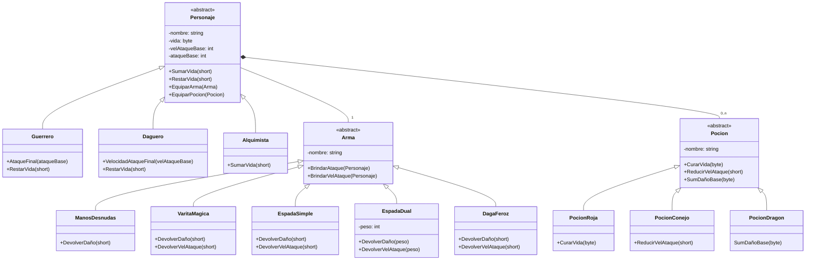

# Diagrama de Clases RPG

```mermaid
    classDiagram
    class Personaje {
        <<abstract>>
        -nombre: string
        -vida: byte
        -velAtaqueBase: int
        -ataqueBase: int
        +SumarVida(short)
        +RestarVida(short)
        +EquiparArma(Arma)
        +EquiparPocion(Pocion)
    }
    class Guerrero {
        +AtaqueFinal(ataqueBase)
        +RestarVida(short)
    }
    class Daguero {
        +VelocidadAtaqueFinal(velAtaqueBase)
        +RestarVida(short)
    }
    class Alquimista {
        +SumarVida(short)
    }
    class Arma {
        <<abstract>>
        -nombre: string
        +BrindarAtaque(Personaje)
        +BrindarVelAtaque(Personaje)
    }
    class ManosDesnudas {
        +DevolverDaño(short)
    }
    class VaritaMagica {
        +DevolverDaño(short)
        +DevolverVelAtaque(short)
    }
    class EspadaSimple {
        +DevolverDaño(short)
        +DevolverVelAtaque(short)
    }
    class EspadaDual {
        -peso: int
        +DevolverDaño(peso)
        +DevolverVelAtaque(peso)
    }
    class DagaFeroz {
        +DevolverDaño(short)
        +DevolverVelAtaque(short)
    }
    class Pocion {
        <<abstract>>
        -nombre: string
        +CurarVida(byte)
        +ReducirVelAtaque(short)
        +SumDañoBase(byte)
    }
    class PocionRoja {
        +CurarVida(byte)
    }
    class PocionConejo {
        +ReducirVelAtaque(short)
    }
    class PocionDragon {
        SumDañoBase(byte)
    }
    Personaje <|-- Guerrero
    Personaje <|-- Daguero
    Personaje <|-- Alquimista
    Personaje -- "1" Arma
    Personaje *-- "0..n"Pocion
    Arma <|-- ManosDesnudas
    Arma <|-- VaritaMagica
    Arma <|-- EspadaSimple
    Arma <|-- EspadaDual
    Arma <|-- DagaFeroz
    Pocion <|-- PocionRoja
    Pocion <|-- PocionConejo
    Pocion <|-- PocionDragon
```